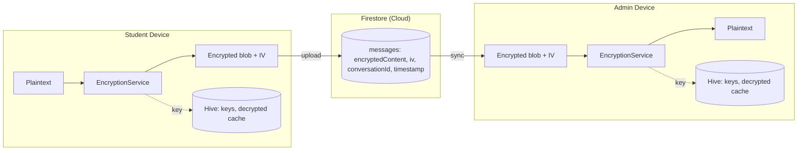

# AnonCast Security Architecture

## Overview

AnonCast uses **zero-knowledge end-to-end encryption (E2EE)** so that messages are encrypted on the sender's device and only decrypted on the recipient's device. **AnonCast administrators and cloud infrastructure providers cannot read message content.** Only devices that hold the per-conversation encryption key can decrypt messages.

**Implementation references:**

- Message flow: [`lib/services/message_service.dart`](../lib/services/message_service.dart)
- Encryption: [`lib/services/encryption_service.dart`](../lib/services/encryption_service.dart)
- Key exchange (access codes): [`lib/services/access_code_service.dart`](../lib/services/access_code_service.dart)

---

## Architecture Diagram



**Data flow:**

1. **Student:** Types message → encrypted with conversation key from Hive → ciphertext + IV uploaded to Firestore; plaintext cached in Hive.
2. **Firestore:** Stores only encrypted blobs and metadata (conversationId, timestamp, senderId). No keys, no plaintext.
3. **Admin:** Receives encrypted documents → decrypts with same conversation key from Hive → displays plaintext; caches in Hive.

---

## Encryption Details

### Encryption Algorithm

| Property        | Value |
|----------------|-------|
| **Algorithm**  | AES-256 in CBC mode |
| **Key length** | 256 bits (32 bytes) |
| **IV length**  | 128 bits (16 bytes) |
| **Padding**    | PKCS#7 |
| **Library**    | [PointyCastle](https://pub.dev/packages/pointycastle) (Dart) |

Defined in [`lib/services/encryption_service.dart`](../lib/services/encryption_service.dart): `_aesKeyLengthBytes = 32`, `_ivLengthBytes = 16`, `CBCBlockCipher(AESEngine())`, `PKCS7Padding()`.

### Key Generation

Conversation keys are 256-bit random values from a cryptographically secure RNG. They are **never** sent to the server.

```dart
// Pseudocode (see EncryptionService.generateConversationKey)
conversationKey = secureRandomBytes(32)   // CSPRNG
keyBase64 = base64Encode(conversationKey)
storeLocally(conversationId, keyBase64)   // Hive only; never Firestore
```

- Implementation: [`EncryptionService.generateConversationKey()`](../lib/services/encryption_service.dart), [`HiveConversationKeyStorage`](../lib/services/encryption_service.dart).

### Message Encryption Flow

1. User types message: e.g. `"I need help"`.
2. App gets conversation key from local storage (Hive) for that `conversationId`.
3. Generate random IV (16 bytes) per message.
4. Encrypt: `AES-256-CBC(plaintext, key, IV)` with PKCS#7 padding.
5. Encode: `Base64(ciphertext)` and `Base64(IV)` (stored separately in Firestore).
6. Upload to Firestore: `{ encryptedContent, iv, conversationId, senderId, timestamp }` — **no plaintext field**.
7. Cache plaintext in Hive for fast local display.

See: [`MessageService.sendMessage`](../lib/services/message_service.dart), [`EncryptionService.encryptMessage`](../lib/services/encryption_service.dart), [`Message.toFirestore`](../lib/models/message.dart) (encrypted data only).

### Message Decryption Flow

1. Receive document from Firestore: `encryptedContent`, `iv`, `conversationId`, etc.
2. Get conversation key from Hive for that `conversationId`.
3. Decode: `Base64Decode(encryptedContent)` and `Base64Decode(iv)`.
4. Decrypt: `AES-256-CBC(ciphertext, key, IV)`.
5. Store plaintext in Hive and display to user.

See: [`MessageService`](../lib/services/message_service.dart) (Firestore snapshot → decrypt → Hive), [`EncryptionService.decryptMessage`](../lib/services/encryption_service.dart), [`Message.fromFirestore`](../lib/models/message.dart).

---

## Key Management

### Key Storage

| Data                | Location              | Notes |
|---------------------|------------------------|-------|
| Conversation keys   | Hive box `conversation_keys` | Per-conversation AES key (base64); never sent to Firestore. |
| Org master key      | Flutter Secure Storage | Used to encrypt conversation keys for admin recovery. |
| Messages (decrypted)| Hive box `messages`   | Local cache; cleared on logout. |

- **Implementation:** [`HiveConversationKeyStorage`](../lib/services/encryption_service.dart), [`LocalStorageService`](../lib/services/local_storage_service.dart), [`KeyManager`](../lib/services/key_manager.dart) (secure storage for org keys).
- **Backup:** Admins can export keys via a **password-encrypted** backup (PBKDF2 + AES-256-CBC). See [`SyncService.exportEncryptedKeys`](../lib/services/sync_service.dart) / [`SyncService.importEncryptedKeys`](../lib/services/sync_service.dart).

### Key Exchange (Access Codes)

1. **Admin** generates an access code (e.g. 6-character) and sets expiry (default up to 30 days).
2. System creates a new conversation and a new AES-256 conversation key.
3. Conversation key is encrypted for the student using a key derived from the access code (PBKDF2) and stored in Firestore as `encryptedForStudent`.
4. **Student** enters the code; app derives the same key, decrypts `encryptedForStudent`, and stores the conversation key in local Hive.
5. Code is marked **used** (single-use) and cannot be redeemed again.

**Security notes:**

- Access codes are **single-use** and **expire** (max 30 days configurable).
- Keys are **never** stored in Firestore in plaintext; only key material encrypted for student or for org recovery.

See: [`AccessCodeService`](../lib/services/access_code_service.dart), [`AccessCodeService.generateAccessCode`](../lib/services/access_code_service.dart), [`AccessCodeService.redeemAccessCode`](../lib/services/access_code_service.dart).

### Key Rotation

- **When:** Every **30 days** or after **10,000 messages** per conversation (configurable).
- **Process:** Generate new key → re-encrypt all messages in Firestore and in Hive → set new key as current; previous key is kept in `oldKeys` for decrypting history.
- **Backward compatibility:** Messages are decrypted using the key version stored with the conversation key; old keys remain available for historical messages.

See: [`ConversationKeyRotationService`](../lib/services/conversation_key_rotation_service.dart), [`KeyRotationService`](../lib/services/key_rotation_service.dart), [`ConversationKey`](../lib/models/conversation_key.dart) (version, oldKeys).

---

## Data Storage

### Firestore (Cloud)

**Stored:**

- Encrypted message blobs (`encryptedContent`, `iv`)
- Metadata: `conversationId`, `senderId`, `timestamp`, status, etc.
- Access code documents (with `encryptedForStudent`, `encryptedConversationKey` for recovery — no plaintext keys)
- User/auth data (no message content)

**Not stored:**

- Plaintext message content
- Encryption keys (only encrypted key material for student redeem or org recovery)
- Any decrypted data

See: [Firestore rules](../firestore.rules), [example documents](../docs/firestore_example_documents.md), [`Message.toFirestore`](../lib/models/message.dart).

### Hive (Local Device)

**Stored:**

- Decrypted messages (cache for fast display)
- Conversation keys (per-conversation AES keys)
- Pending messages (offline queue)
- User preferences

**Security:**

- Cleared on logout via [`PrivacyService.cleanupOnLogout`](../lib/services/privacy_service.dart) (secure overwrite then delete for keys and messages).
- Stored in app documents directory (cleared by OS on uninstall).
- Recommendation: consider `hive_encrypted_box` for encryption at rest (see security audit recommendations).

See: [`LocalStorageService`](../lib/services/local_storage_service.dart), [`PrivacyService`](../lib/services/privacy_service.dart).

---

## Threat Model

### Protected Against

| Threat | Mitigation |
|--------|------------|
| **Cloud provider access** | Firebase/Google cannot read messages; only ciphertext and metadata are stored. |
| **Database breach** | Stolen Firestore data is useless without per-device keys. |
| **Man-in-the-middle** | TLS in transit; E2EE ensures content is secret even if TLS were compromised. |
| **Compromised server** | No plaintext or keys on server. |
| **Subpoena / warrant** | We cannot provide message content; we do not have it. |
| **Key leakage to Firestore** | Security audit checks that no forbidden key fields appear in message documents. |

### Not Protected Against

| Threat | Mitigation / note |
|--------|--------------------|
| **Physical access to unlocked device** | User should lock device; logout clears local data. |
| **Malware on device** | Keylogger could capture input before encryption; use trusted devices. |
| **Shared devices** | Logout clears sensitive data; encourage logout on shared devices. |

---

## Compliance

### GDPR

- **Right to be forgotten:** Delete user data from Firestore and local Hive; [`PrivacyService.deleteAllUserData`](../lib/services/privacy_service.dart), secure local wipe.
- **Data minimization:** Only encrypted payloads and necessary metadata on servers; no plaintext content.
- **Data portability:** Encrypted key export (password-protected) for admins; GDPR export of user data via [`PrivacyService.exportUserData`](../lib/services/privacy_service.dart).

### COPPA (Children's Privacy)

- No personal information required from minors for anonymous use.
- Anonymous accounts; institution/admin controls access via codes.
- Design supports minimal collection and no profiling of children.

---

## Security Audits

### Internal Validation

The app includes an automated security audit that can be run from **Settings** or **Admin System Settings**:

```dart
final validator = SecurityValidator(
  firestore: firestore,
  storage: storage,
  encryption: encryptionService,
);
final report = await validator.runSecurityAudit(
  conversationIdsToCheck: optionalConversationIds,
  messageIdToCheck: optionalMessageId,
);
// report.allPassed, report.results, report.warnings, report.recommendations
```

**Checks performed:**

- **Keys not in Firestore:** No forbidden key-related fields in message documents.
- **Local storage path:** Hive/data path is app-private (where available).
- **Message encryption:** Sampled messages have `encryptedContent` and `iv` (base64), no plaintext.
- **Decryption integrity:** Firestore message decrypts correctly and matches local cache where applicable.

See: [`SecurityValidator`](../lib/services/security_validator.dart), [`SecurityReport`](../lib/models/security_report.dart). UI: [`SettingsScreen`](../lib/screens/settings/settings_screen.dart), [`AdminSystemSettingsScreen`](../lib/screens/admin_system_settings_screen.dart).

### External Audit (Recommended)

Before production launch:

1. Commission a penetration test from a reputable security firm.
2. Arrange a code review by a cryptography/security expert.
3. Consider a security certification for marketing and compliance.

---

## FAQ

**Q: Can AnonCast staff read messages?**  
**A:** No. Messages are encrypted on the user’s device before upload. We only store encrypted blobs and metadata.

**Q: What if I lose my device?**  
**A:** Admins can use key recovery (encrypted backup or org-key decryption of stored key material). Students lose access if they lose the device and have no backup — by design, to preserve anonymity and avoid storing identity-linked keys.

**Q: Is this as secure as Signal?**  
**A:** We use a similar principle: E2EE so the server cannot read content. Signal uses the Signal Protocol (double ratchet, etc.); AnonCast uses AES-256-CBC with per-conversation keys and prioritizes anonymity (e.g. no phone number).

**Q: What about metadata?**  
**A:** Firestore knows that a conversation exists, timestamps, message count, and sender identifiers. It does **not** know message content or, in anonymous mode, real user identity.

**Q: Where can I see the code?**  
**A:** Main entry points: [`lib/services/encryption_service.dart`](../lib/services/encryption_service.dart), [`lib/services/message_service.dart`](../lib/services/message_service.dart), [`lib/services/access_code_service.dart`](../lib/services/access_code_service.dart), [`lib/services/security_validator.dart`](../lib/services/security_validator.dart), and [`lib/services/privacy_service.dart`](../lib/services/privacy_service.dart).

---

*This document is intended for developers, auditors, and marketing. For Firestore schema examples, see [docs/firestore_example_documents.md](../docs/firestore_example_documents.md).*
